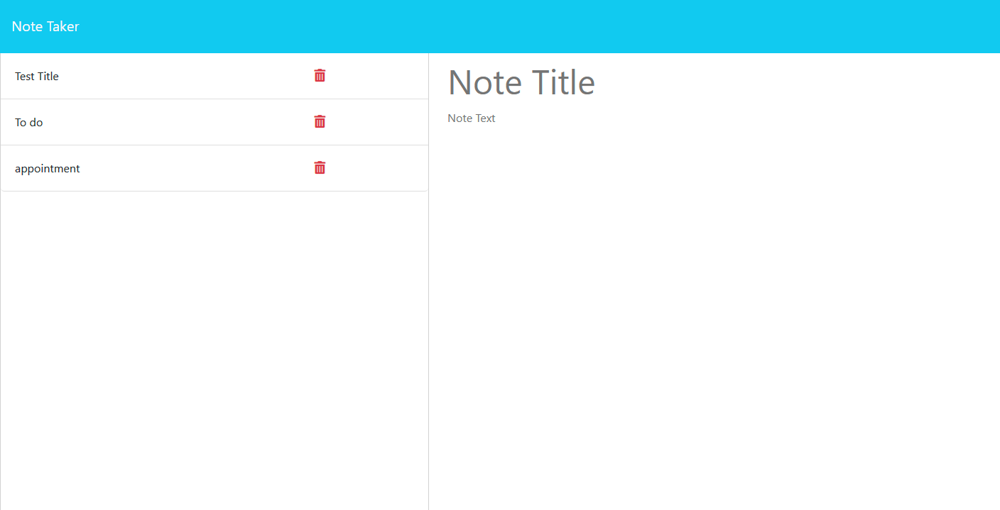

# Note Taker

Note Taker is a web application that allows you to create, save, and delete notes. 
This application is perfect for keeping track of tasks, reminders, or any other 
information that needs to be organized.

## Features

* Create and save notes with a title and text content
* View saved notes in a list
* Delete notes from the list

## Getting Started

To set up Note Taker on your local machine, follow these instructions:

1. Clone the repository to your local machine: 
Replace `yourusername` with your GitHub username and `notetaker` 
with the repository name, if you have a different one.
2. Navigate to the project directory:
3. Install the required dependencies:
4. Start the local development server:
5. Open your browser and visit `http://localhost:3001`.

## Technologies Used 
* HTML
* CSS
* JavaScript
* Express 
* Heroku

##  Links

[Heroku Deployment](https://rocky-temple-29767.herokuapp.com/)

[Git Hub](https://github.com/Daniel-Covington/Note_Taker)

## Preview

The following image demonstrates the web application's appearance and functionality:

